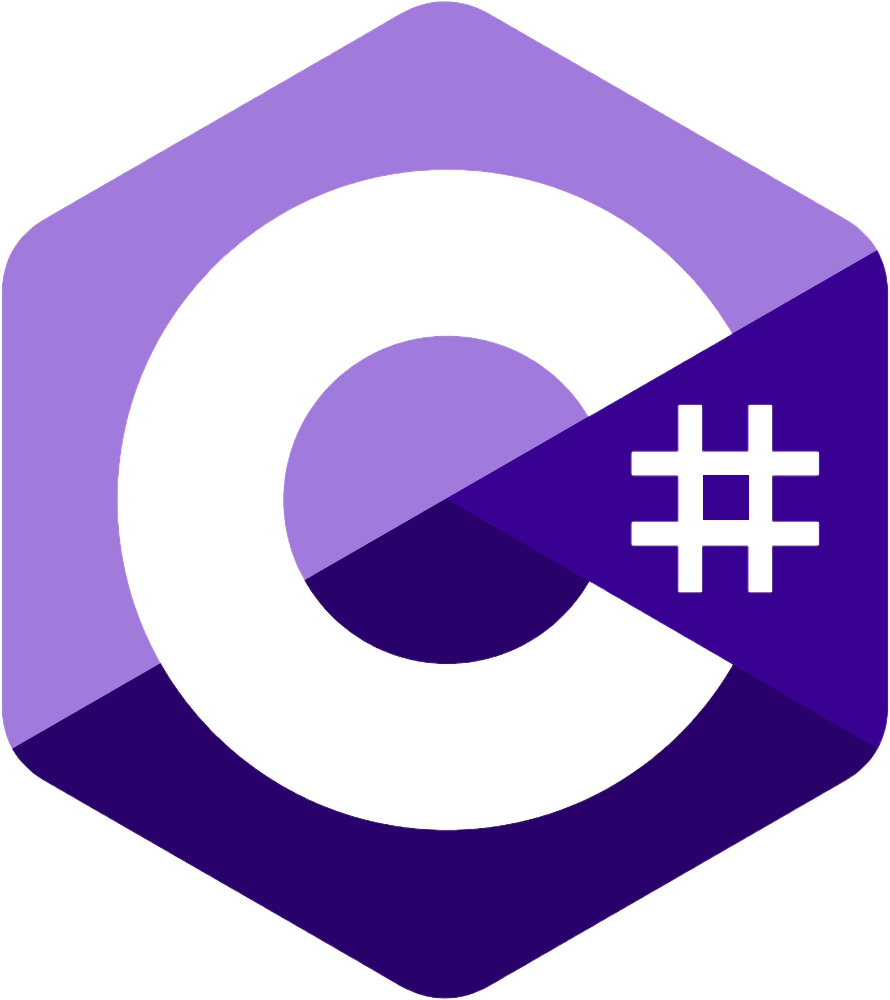

<p align="center">
    <a href="https://github.com/TheArchitect123"></a>
</p>

<p align="center">
The Official C# SDK for the Terra Ecosystem (LUNC/USTC/LUNA2)
</p>
<br/>

<p align="center">
  <a href="https://github.com/TerraMystics/Terra.Microsoft.Client/blob/main/LICENSE.md">
  
  </a>

  <a href="https://www.nuget.org/packages/Terra.Microsoft.Client/1.0.1">
    
  </a>
  
  <a href="https://www.nuget.org/packages/Terra.Microsoft.Client/1.0.1">
    
  </a>
</p>

<p align="center">
  <a href="https://docs.terra.money/"><strong>Explore the Docs »</strong></a>
  <br />
  <br/>
  <a href="https://github.com/terra-rebels/Terra.Microsoft.Client/tree/master/Terra.Microsoft.Client.Maui.Example">Example App</a>
  ·
  <a href="https://terra-rebels.github.io/Terra.Microsoft.Client/Terra.Microsoft.Client/Documentation/html/index.html">API Reference</a>
  ·
  <a href="https://www.nuget.org/packages/Terra.Microsoft.Client/1.0.1">Nuget Package</a>
  ·
  <a href="https://github.com/terra-rebels/Terra.Microsoft.Client">GitHub</a>
</p>

Terra.Microsoft.Client is a C# SDK for writing applications that interact with the Terra blockchain from either the Web or Mobile, or .net environments and provides simple abstractions over core data structures, serialization, key management, and API request generation.

## Features

- **Written in C#**, with type definitions
- Versatile support for [key management](https://docs.terra.money/develop/feather-js/keys) solutions
- Works with Xamarin, MAUI, in the browser, and Mobile
- Exposes the Terra API through [`LCDClient`](https://docs.terra.money/develop/terra-py/client/lcd/lcdclient)
- Parses responses into native C# types

We highly suggest using Terra.Microsoft.Client in a code editor that has support for type declarations, so you can take advantage of the helpful type hints that are included with the package.

## Installation & Configuration

Grab the latest version off [Nuget](https://www.nuget.org/packages/Terra.Microsoft.Client/1.0.1)

```sh
dotnet add package Terra.Microsoft.Client
```

Please make sure to add the following nuget Packages into your .csproj file
```sh
<ItemGroup>
      <PackageReference Include="Cryptography.ECDSA.Secp256k1" Version="1.1.3" />
      <PackageReference Include="Microsoft.Extensions.Hosting" Version="6.0.1" />
      <PackageReference Include="Microsoft.Extensions.Http.Polly" Version="6.0.9" />
      <PackageReference Include="modernhttpclient-updated" Version="3.4.3" />
      <PackageReference Include="NBitcoin" Version="7.0.23" />
      <PackageReference Include="Newtonsoft.Json" Version="13.0.1" />
      <PackageReference Include="Ninject" Version="3.3.6" />
      <PackageReference Include="Polly" Version="7.2.3" />
      <PackageReference Include="Polly.Extensions.Http" Version="3.0.0" />
      <PackageReference Include="RandomStringCreator" Version="2.0.0" />
      <PackageReference Include="System.Security.Cryptography.Algorithms" Version="4.3.1" />
      <PackageReference Include="protobuf-net" Version="3.1.22" />
      <PackageReference Include="Protobuf.Grpc" Version="1.0.170" />
      <PackageReference Include="Terra.Microsoft.Extensions" Version="1.0.1" />
      <PackageReference Include="Terra.Microsoft.ProtoBufs" Version="1.0.1" />
      <PackageReference Include="Terra.Microsoft.Rest" Version="1.0.0" />
</ItemGroup>
```

Inside your Startup Class (Where you initialize your application), please call the following method, and configure your environment
```cs
// Here we're targeting the Classic Blockchain
TerraStartup.InitializeKernel(TerraEnvironment.Classic);
```
That's it! Now you're ready to start communicating with the blockchain! 

## Usage

Terra.Microsoft.Client can be used for Mobile & Web Developers. Supports all Microsoft Technologies from Xamarin, MAUI, ASP & Unity.

### Getting Blockchain data
:exclamation: Terra.Microsoft.Client can connect to both the terra-classic (LUNC/USTC) and LUNA2 networks. If you want to communicate with the classic chain, you have to set your Enviornment on **TerraStartup.InitializeKernel** to **TerraEnvironment.Classic**.

Below we're going to pull balance information on a sample wallet.
```cs
async void FetchBalanceInformation() {
    //fetch the LCDClient from the Kernel
    var lcd = TerraStartup.GetLCDClient();
    
    // get the current balance of "terra1x46rqay4d3cssq8gxxvqz8xt6nwlz4td20k38v"
    var balance = await lcd.bank.GetBalance("terra1x46rqay4d3cssq8gxxvqz8xt6nwlz4td20k38v");
    Console.WriteLine(balance);
}
```

### Broadcasting transactions

First, [get](https://faucet.terra.money/) some testnet tokens for "terra17lmam6zguazs5q5u6z5mmx76uj63gldnse2pdp".
Here we are going to send some tokens to a recipient address.

```cs
async void BroadcastTransaction() {
    // Create a key out of a mnemonic
    var mnemonic = new MnemonicKey("notice oak worry limit wrap speak medal online prefer cluster roof addict wrist behave treat actual wasp year salad speed social layer crew genius");

    // Define the recipient address
    var rAddr = "terra1x46rqay4d3cssq8gxxvqz8xt6nwlz4td20k38v";

    // Define your wallet -- The account that will handle the transactions
    var wallet = TerraStartup.GetLCDClient().CreateWallet("terra17lmam6zguazs5q5u6z5mmx76uj63gldnse2pdp", mnemonic);

    // Define your message to broadcast
    var send = new MsgSend(
       wallet.accAddress,
       rAddr,
       new List<Core.Coin>() { new Core.Coin(CoinDenoms.ULUNA, 20) });

    var msgs = new object[] { send };

    // Calculate the estimated Gas required for the transaction to succeed (it auto accounts for the new burn tax)
    var gas = await wallet.EstimateGasForTx(100000, msgs);
    
    // Calculate the fees required to handle the transaction
    var feeEstimate = await wallet.EstimateFeeForTx(100000, new CreateTxOptions()
    {
       gas = gas,
       feeDenom = CoinDenoms.ULUNA,
       gasAdjustment = 3,
    });
 
    // Broadcast the transaction 
    var broadcast = await wallet.broadcastTx.Broadcast(await wallet.CreateTxAndSignTx(feeEstimate, msgs));
    System.Diagnostics.Debug.WriteLine("Uploaded Tx Hash" + broadcast.Txhash);
}
```

## Requirements for Legacy Versions of .Net (Standard 2.0 or Above)?

If you are building for a project that doesn't target .net 6, please use the following package [Legacy Package](https://www.nuget.org/packages/Terra.Microsoft.Client/1.0.1.Legacy).


## Require Payment Integration for LUNC/USTC?

If you need to integrate with an external payment system or gateway like Apple/Google in app purchases, please make sure to install the [following library](https://github.com/terra-rebels/Terra.Microsoft.Client-InAppPurchases) in your project.


## Terra.Microsoft.Client For Unity Developers

If you are using Terra.Microsoft.Client for Unity, please make sure to install the [following asset](https://github.com/terra-rebels/NuGetForUnity) in your project, and follow the installation instructions above

## License

This software is licensed under the MIT license. See [LICENSE](./LICENSE) for full disclosure.

© 2022 TerraMystics.
